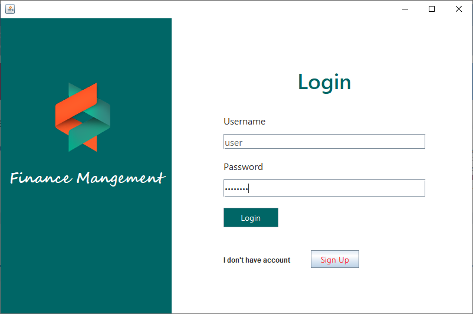

# Daily Expensive Tracker 

## Overview
The Daily Expense Tracker is a project designed to help users keep track of their daily spending using a combination of Java, JavaScript, and a relational database. Here’s an overview:
The tracker includes features such as user authentication for secure logins, the ability to add, edit, and delete expenses, and the option to organize expenses by categories like food, transport, and utilities. It also includes data visualization, showing users charts and graphs to help them understand their spending patterns. Users can search and filter expenses by date, category, or tags, and the interface is built to be responsive, ensuring a good experience on both desktop and mobile devices.
The project uses Java (Spring Boot) for backend services, JavaScript for the interactive frontend, and a database like MySQL or PostgreSQL for storing data. For connecting to the database, JDBC is used, and for creating visual representations of data, tools like Chart.js may be employed.
The structure of the project is divided into backend components for handling requests and business logic, and frontend components for user interface functionality. The database schema is designed with tables that store users, their expenses, and categories, linked together by relationships.
To run the project, you would clone the repository, set up the database, and run the backend server with Maven or Gradle. The frontend can be served alongside the backend or through a separate server.
Enables users to monitor their financial habits, track previous transactions, and visualize monthly financial data using charts.

## Software Used
- **IDE:** Apache NetBeans
- **Database:** MySQL
- **Java UI Framework:** Java Swing
- **Chart Library:** XChart

## Features
1. **Account Management:** Users can create and manage multiple accounts to meet their financial needs.
2. **Summarized Display:** Provides users with a clear overview of their financial status, including current savings and spending habits.
3. **Income and Expense Tracking:** Dedicated tabs allow users to conveniently record their income and expenses, facilitating efficient management of finances.
4. **Interactive Charts:** Visualize monthly expenditure and savings through interactive charts, offering users insightful graphical representations of their financial data.
5. **Transaction History:** Easily access and review the latest transactions, enabling users to track their financial activity over time.
6. **Savings Target:** Set savings targets with a progress bar indicating the progress towards the goal for the current month, empowering users to stay focused on their financial objectives.

## Additional Libraries Used
- **JDBC Driver (MySQL Connector):** Connects Java applications to MySQL databases.
- **JCalendar:** Provides Date-related components for user-friendly date selection.
- **XChart:** Generates interactive charts for visualizing financial data.
- **AbsoluteLayout:** Facilitates precise positioning of UI components.

### Login

### Signup

### Home

### Accounts

### Income

### Expense

### Budget

## Installation
1. Open the project in Apache NetBeans.
2. Set up the MySQL database according to the provided schema.
   - Navigate to the `database_setup` folder and follow the instructions in the `README.md` file to set up the database.
3. Run the project.

## Usage
1. Sign up for an account or log in if you already have one.
2. Add accounts and set up your financial details.
3. Record your income and expenses.
4. Monitor your financial status through the provided charts and summaries.

## Contributors
- [Piyali Choudhury](https://github.com/PiyaliChoudhury)
